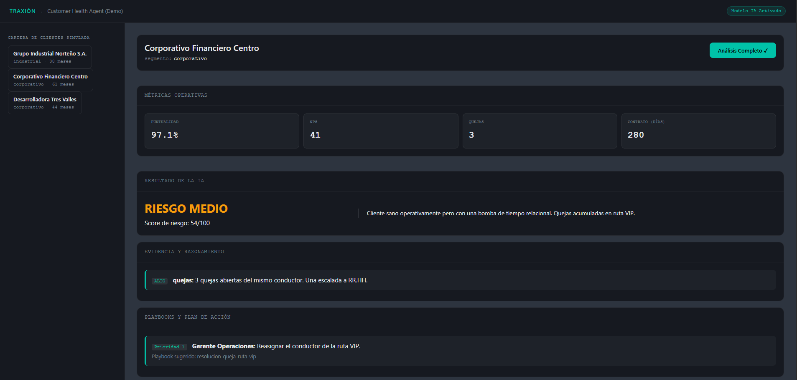

# 🚚 Customer Health Agent | Traxión

**Hackatón Bécalos Traxión Tech Challenge 2026 - Eje 2: Clientes en Riesgo**

Un dashboard estratégico y motor de decisiones impulsado por IA diseñado para detectar de forma temprana el riesgo de abandono (*churn*) en clientes corporativos e industriales de Traxión. 

Reemplazamos la gestión reactiva con diagnósticos proactivos, cruzando métricas operativas (SLA, NPS, Quejas) con contexto relacional para recomendar acciones concretas mediante *Playbooks* estandarizados.

---

## 🚀 Tecnologías Utilizadas

- **Diseño UI/UX** con HTML5 y CSS3 puro (Grid y Flexbox), manteniendo el alcance operativo del reto.
- **Arquitectura de Datos**: JSON Schema estricto para estandarizar entradas (métricas) y salidas (diagnósticos).
- **IA y Lógica de Negocio**: System Prompt estructurado con roles, manejo de incertidumbre y delegación de responsabilidades.
- **Simulación Frontend**: JavaScript nativo ligero para simular tiempos de respuesta de IA en la demo.

---

## 👥 Equipo de Desarrollo

| Foto | Nombre | Rol | Redes |
| :---: | :--- | :--- | :--- |
|  | **Jonathan Caixba** | Integración y Frontend |   |
|  | **Fernando Rubio** | Lógica de Negocio y Prompting |   |
|  | **Axel Aviles** | Estructura de Datos (JSON) |  |

---

## ✨ Características Principales

- **Semáforo de Riesgo Inteligente**: Clasifica clientes en Riesgo Alto, Medio o Bajo no solo por una métrica caída, sino por el cruce de factores (ej. *Churn* silencioso: NPS estable + aumento de cancelaciones + falta de contacto).
- **Manejo de Incertidumbre**: El agente audita la falta de información y ajusta el "Nivel de Confianza", evitando alucinaciones de la IA.
- **Playbooks de Acción Directa**: Genera de 1 a 3 acciones priorizadas con responsables explícitos (Account Manager, Operaciones o Dirección Comercial).
- **Diseño Corporativo Moderno**: Modo oscuro elegante, tipografías monoespaciadas para datos duros y sistema de *badges* para facilitar la lectura ejecutiva.
- **Auditable y Transparente**: La IA siempre justifica su decisión mostrando el peso asignado a cada evidencia.

---

## 📸 Vista Previa

> *Dashboard principal mostrando el análisis en tiempo real de un perfil corporativo en riesgo.*
>   by: Equipo ARC🚀